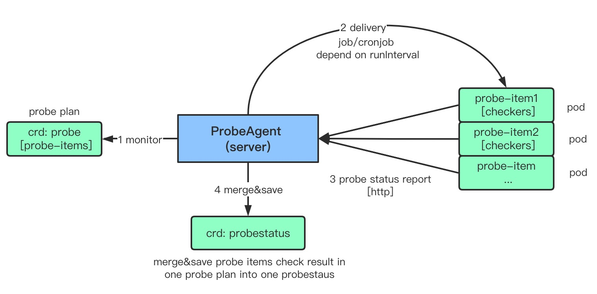

# ProbeAgent Architecture


## What is Probe?
Probe is a diagnostic plan running in a k8s cluster.  A probe contains a list of probe items which running as pods 
and a probe item has a list of checkers which is the smallest diagnostic unit. 
Probe samples can be found [here](../config/samples).

Probe example:
```
apiVersion: kubeprober.erda.cloud/v1
kind: Probe
metadata:
  name: addons-probe
  namespace: kubeprober
spec:
  policy:
    # unit: minute
    # if runInterval assigned, probe will run as cronjob, else just run once as a job
    runInterval: 2
  probeList:
    # probe item1
    - name: probe-item1-redis-check
      spec:
        containers:
          - env:
             - name: HOSTNAME
               value: "redis.hostname"
             - name: PORT
               value: "6379"
            name: redis-check
            image: kubeprober/redis-check:v0.0.xxx
            resources:
              requests:
                cpu: 10m
                memory: 50Mi
        restartPolicy: Never
    # probe item2
    - name: probe-item2-elasticsearch-check
      spec:
        containers:
          - env:
            - name: HOSTNAME
              value: "redis.hostname"
            - name: PORT
              value: "6379"
            name: elasticsearch-check
            image: kubeprober/elasticsearch-check:v0.0.xxx
            resources:
              requests:
                cpu: 10m
                memory: 50Mi
        restartPolicy: Never
```

## Probe Item and Checkers
A probe item will running as pod and do a list of checkers. After checks done, the check result will be send to probe-agent 
through the provided api. Probe item examples can be found [here](../probers).

Probe item example:
```
package main

import (
    "github.com/sirupsen/logrus"
    
    # define check status level: CheckerStatusInfo ... CheckerStatusError
    kubeproberv1 "github.com/erda-project/kubeprober/apis/v1"
    # define ReportProbeStatus api used to send checkers result
    status "github.com/erda-project/kubeprober/pkg/probe-status"
)

func main() {
    ...
    # do real check work
    ...
    # result of the checkers
    report := []kubeproberv1.ProbeCheckerStatus{
		{
			Name:   "REDIS-GET",
			Status: kubeproberv1.CheckerStatusInfo,
		},
		{
			Name:    "REDIS-UPDATE",
			Status:  kubeproberv1.CheckerStatusInfo,
		},
		{
			Name:    "REDIS-DELETE",
			Status:  kubeproberv1.CheckerStatusWARN,
			Message: "WARN: non info level status message cannot be empty",
		},
		{
			Name:    "REDIS-ADD",
			Status:  kubeproberv1.CheckerStatusError,
			Message: "ERROR: non info level status message cannot be empty, message: add failed, error: xxxx",
		},
	}
    # report check result to probe-agent through the provided api
    if err := status.ReportProbeStatus(report); err != nil {
		logrus.Errorf("report probe status failed, err: %v", err)
	}
}
```

### Tips:

* Probe status report url is injected in the pod environment by probe-agent, so SDK can get it and report check result
back to probe-agent.

* Probe status priority: `ERROR > WARN > UNKNOWN > INFO`

* The image build method is same as probe-agent.


## Probestatus
After probe item check results report to probe-agent, they will be saved as probestatus with the same name as origin probe. 
Probe items check results coming from same probe will be merged and save in same probestatus.

Probestatus example:
```
apiVersion: kubeprober.erda.cloud/v1
kind: ProbeStatus
metadata:
  name: addons-probe
  namespace: kubeprober
spec:
  # probe result from all probe items in a probe plan
  detail:
  # probe-item1, probe result from one probe item
  - checkers:
    - lastRun: "2021-07-01T02:10:07Z"
      name: REDIS-GET
      status: INFO
    - lastRun: "2021-07-01T02:10:07Z"
      name: REDIS-UPDATE
      status: UPDATE
    - lastRun: "2021-07-01T02:10:07Z"
      name: REDIS-DELETE
      status: WARN
      message: WARN: non info level status message cannot be empty
    - lastRun: "2021-07-01T02:10:07Z"
      name: REDIS-ADD
      status: ERROR
      message: ERROR: non info level status message cannot be empty, message: add failed, error: xxxx
    # overall result of the checkers in one probe item
    lastRun: "2021-07-01T02:10:07Z"
    name: probe-item1-redis-check
    status: ERROR
    message: ERROR: non info level status message cannot be empty, message: add failed, error: xxxx
  # probe-item2 , probe result from one probe item
  - checkers:
    - lastRun: "2021-07-01T02:10:07Z"
      name: ELASTICSEARCH-GET
      status: INFO
    - lastRun: "2021-07-01T02:10:07Z"
      name: ELASTICSEARCH-UPDATE
      status: UPDATE
    - lastRun: "2021-07-01T02:10:07Z"
      name: ELASTICSEARCH-DELETE
      status: WARN
      message: WARN: non info level status message cannot be empty
    - lastRun: "2021-07-01T02:10:07Z"
      name: ELASTICSEARCH-ADD
      status: ERROR
      message: ERROR: non info level status message cannot be empty, message: add failed, error: xxxx
    # overall result of the checkers in one probe item
    lastRun: "2021-07-01T02:10:07Z"
    name: probe-item1-redis-check
    status: ERROR
    message: ERROR: non info level status message cannot be empty, message: add failed, error: xxxx
  # overall result of all probe items
  lastRun: "2021-07-01T02:10:36Z"
  name: addons-probe
  namespace: kubeprober
  status: ERROR
  # for convenience, only get one latest error message from probe items
  message: ERROR: non info level status message cannot be empty, message: add failed, error: xxxx
``` 